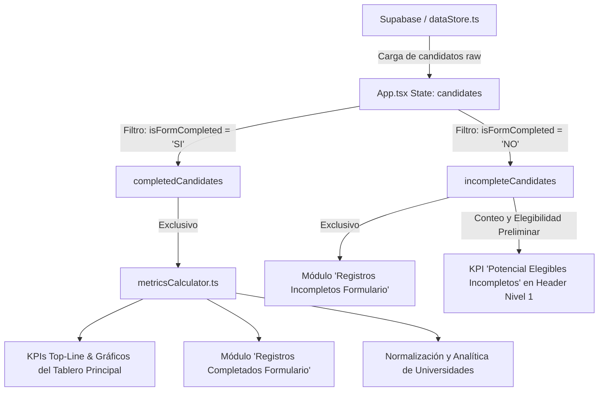

# DOCUMENTACIÓN TÉCNICA Y FUNCIONAL DEL DASHBOARD CONVOCATORIA LIDERA (COHORTE 2027)

> **Propósito de este documento:**  
> Sirve como manual de referencia técnica, de arquitectura y de reglas de negocio para el mantenimiento, actualización y trazabilidad del Dashboard de Convocatoria LIDERA. Diseñado como insumo detallado para desarrolladores y asistentes de IA (como Claude).

---

## 1. Flujo de Origen y Pipeline de Datos (ETL)

El ecosistema de información de la Convocatoria LIDERA sigue un flujo de datos estructurado en 4 capas secuenciales que garantizan la sincronización periódica (frecuencia horaria):

```mermaid
flowchart LR
    A[1. Salesforce CRM<br/><i>Fuente Primaria de Captura</i>] -->|Sincronización de Postulaciones| B[2. Google Sheets<br/><i>Matriz Operativa</i>]
    B -->|Procesamiento automatizado<br/>vía Google Apps Script| C[Campos Calculados &<br/>Elegibilidad Inicial]
    C -->|Sincronización vía Script| D[3. Supabase<br/><i>Base de Datos Cloud / API</i>]
    D -->|Consumo REST / Sync local| E[4. Dashboard React SPA<br/><i>Visualización y Analítica</i>]
```



### Detalle de las Capas de la Canalización de Datos:

1. **Capa 1 — Salesforce (Fuente de Verdad & CRM):**
   - Es el repositorio primario donde los postulantes diligencian el formulario de convocatoria.
   - Contiene la totalidad de campos detallados de seguimiento, incluyendo el estado de avance del formulario, archivos cargados y **el desglose exacto de secciones/campos faltantes** para registros incompletos.

2. **Capa 2 — Google Sheets + Google Apps Script (Transformación y Reglas de Negocio):**
   - Extrae periódicamente las filas de candidatos desde Salesforce hacia hojas de trabajo dedicadas.
   - **Google Apps Script:** Ejecuta rutinas automáticas de transformación para calcular campos derivados (ej. banderas de elegibilidad, ponderados de promedio, estandarización de idiomas y niveles de carrera).

3. **Capa 3 — Supabase (Persistencia Cloud e Integración API):**
   - Un script automatizado sincroniza los datos transformados desde Google Sheets hacia tablas estructuradas en **Supabase** (PostgreSQL cloud).
   - Sirve como la capa de persistencia de baja latencia y alta concurrencia para consultar los registros desde aplicaciones web y dashboards analíticos.

4. **Capa 4 — Dashboard React (Capa de Presentación y Métricas en Vivo):**
   - Consume el dataset actualizado (sincronizado o hidratado en el cliente/dataStore) para calcular los KPIs en tiempo real, filtrar postulaciones completas vs. incompletas y renderizar las gráficas de rendimiento.

---

## 2. Visión General de la Arquitectura del Dashboard

El dashboard es una aplicación Web SPA desarrollada con **React 18**, **TypeScript** y **Tailwind CSS**, empaquetada mediante **Vite**.

### Estructura de Directorios Principal
```text
/
├── DASHBOARD_DOCUMENTATION.md          # Este documento de referencia
├── src/
│   ├── App.tsx                         # Contenedor principal, gestión de pestañas y cálculo de métricas reactivas
│   ├── types.ts                        # Definición centralizada de interfaces (Candidate, GoalTarget, etc.)
│   ├── lib/
│   │   ├── metricsCalculator.ts        # Funciones de cálculo de métricas, elegibilidad y reglas de negocio
│   │   ├── dataStore.ts                # Gestión de almacenamiento y persistencia de candidatos/metas
│   │   └── exportUtils.ts              # Utilidades de exportación a CSV/Excel
│   ├── data/
│   │   └── mockData.ts                 # Dataset inicial estático de candidatos y metas
│   └── components/
│       ├── Sidebar.tsx                 # Navegación lateral y badges de conteo
│       ├── Header.tsx                  # Barra superior de marca y filtros globales
│       ├── KpiHeaderBand.tsx           # Banda de KPIs Nivel 1 (Top-Line)
│       ├── CandidateTable.tsx          # Módulo de tabla interactiva (utilizado para completados e incompletos)
│       ├── UniversityNormalization.tsx # Motor de normalización de nombres de universidades
│       ├── UniversityModuleScorecards.tsx # Tarjetas y analítica por universidad
│       └── panels/                     # Paneles de gráficos analíticos (Recharts)
│           ├── PanelUniversitiesDistribution.tsx # Distribución por Depto. Residencia y Universidad
│           ├── PanelEligibilityRate.tsx         # Tasa de elegibilidad
│           ├── PanelProfileComposition.tsx       # Perfil por género, etnia, estrato
│           ├── PanelAcademicProfile.tsx          # Promedio acumulado e idioma
│           ├── PanelYoyVolume.tsx                # Comparativo mensual e histórico
│           └── PanelChannelMix.tsx               # Canales de atracción y conversión
```

---

## 3. Flujo Interno de Datos y Propagación en el Frontend



### Regla Fundamental de Aislamiento de Datos
1. **Universo para Indicadores y Gráficos:** **SOLO** los candidatos con formulario finalizado (`form_completo === 'SI'`) son contabilizados en todas las métricas, KPIs, tarjetas, gráficos de distribución y normalizaciones.
2. **Postulaciones Incompletas:** Los registros con formulario no finalizado (`form_completo === 'NO'`) **se excluyen de todas las métricas analíticas principales** y se gestionan únicamente en su módulo dedicado de auditoría ("Registros incompletos formulario") y en los contadores informativos de potencial.

---

## 4. Reglas de Negocio y Lógica del Código

### A. Validación de Formulario Completado (`isFormCompleted`)
Ubicación: `src/lib/metricsCalculator.ts`
```typescript
export function isFormCompleted(candidate: Candidate): boolean {
  if (!candidate.formCompleto) return true; // fallback por defecto
  const status = candidate.formCompleto.trim().toUpperCase();
  return status === 'SI' || status === 'COMPLETO' || status === 'COMPLETADO' || status === 'YES';
}
```

### B. Regla de Elegibilidad de Candidatos (`isCandidateEligible`)
Un candidato se considera **Elegible** si cumple simultáneamente con los criterios normativos del programa:
1. **Estado de Formulario:** `form_completo === 'SI'` (para postulaciones definitivas).
2. **Nivel de Formación:** Pregrado (`carrera` / `nivelEstudios` válido).
3. **Promedio Acumulado (GPA):** Mayor o igual a `3.75 / 5.0` (o equivalente a escala 75%).
4. **Dominio de Idioma:** Nivel B2, C1 o C2 en inglés (o certificación equivalente registrada).

### C. Distribución por Departamento de Residencia
Ubicación: `src/components/panels/PanelUniversitiesDistribution.tsx`
- **Filtro Aplicado:** Procesa únicamente la colección `completedCandidates`.
- **Tratamiento de Valores Vacíos / Nulos:** Normaliza cualquier cadena vacía, `'N/A'`, `'null'` o `'undefined'` al valor `'Sin Departamento'`.
- Esto garantiza que el universo total de candidatos en el gráfico de departamentos concuerde exactamente con la cantidad de formularios completados (332 en el dataset de referencia baseline).

---

## 5. Módulos de la Aplicación y Funcionalidades

### 1. Tablero Principal (`overview`)
- **Nivel 1 (Banda Top-Line):**
  - **Avance de Meta Global:** Avance porcentual contra la meta oficial (978 candidatos).
  - **Tasa de Elegibilidad General:** Porcentaje de elegibles sobre formularios completados.
  - **Indicador "Formularios Incompletos":** Conteo global de registros pendientes (e.g. 305).
  - **Indicador "Potencial Elegibles (Incompletos)":** Conteo de postulantes en borrador que ya cumplen los criterios cuantitativos de elegibilidad.
- **Gráficos e Indicadores Secundarios:**
  - Distribución por Departamento de Residencia y Universidad.
  - Perfil Académico (Promedio y Nivel de Inglés).
  - Composición Socio-Demográfica (Etnia, Estrato, Género).
  - Volumen Histórico y Proyección YoY.
  - Mezcla de Canales de Atracción.

### 2. Registros Completados Formulario (`candidates`)
- Muestra la tabla interactiva filtrada únicamente con postulantes que finalizaron el formulario (`completedCandidates`).
- Soporta búsqueda de texto libre, filtrado por estado de elegibilidad, universidad, departamento y filtros avanzados.
- Acciones en lote: Marcar como elegible/no elegible, destacar HPC.
- Modal de detalle completo y edición individual de candidatos.

### 3. Registros Incompletos Formulario (`incomplete_candidates`)
- Muestra la tabla interactiva filtrada únicamente con registros pendientes (`incompleteCandidates`).
- **Contador Dinámico Reactivo:**
  - Badge en el encabezado de la tabla:  
    `Potenciales Elegibles: X de Y`
  - Este contador **se recalcula dinámicamente** en tiempo real a medida que el usuario aplica búsquedas o filtros en la tabla.
- **Nota Informativa de Salesforce:**
  - Banner en la parte superior del módulo que aclara:  
    *"Para mayor detalle de los campos faltantes, se debe consultar directamente en Salesforce."*

### 4. Universidad y Normalización (`universities`)
- Módulo para mapear y agrupar variaciones tipográficas en nombres de universidades hacia nombres canónicos oficiales.
- Utiliza **exclusivamente** datos de candidatos completados para evitar distorsiones por nombres parciales en formularios incompletos.

### 5. Metas y Ajustes (`goals`)
- Configuración de metas por cohorte, departamento prioritario y universidad aliada.

---

## 6. Resumen de Últimos Ajustes Implementados

| No. | Ajuste Implementado | Descripción y Justificación | Archivos Afectados |
|---|---|---|---|
| 1 | **Filtro Estricto de Formularios Completados** | Se aisló el cálculo de todos los gráficos y métricas del dashboard para procesar únicamente candidatos con `form_completo === 'SI'`. | `App.tsx`, `PanelUniversitiesDistribution.tsx`, `metricsCalculator.ts` |
| 2 | **Separación en Dos Módulos Independientes** | Se dividió la vista de registros en dos pestañas del Sidebar: **"Registros completados formulario"** y **"Registros incompletos formulario"**. | `Sidebar.tsx`, `App.tsx`, `CandidateTable.tsx` |
| 3 | **Indicador de Potenciales Elegibles Incompletos (Header)** | Se añadió la métrica Top-Line en el header superior para dar visibilidad al potencial de conversión de las postulaciones iniciadas. | `KpiHeaderBand.tsx`, `App.tsx` |
| 4 | **Contador Dinámico Filtrable en Módulo Incompleto** | Se colocó el contador de *Potenciales Elegibles* en la barra superior de la tabla de incompletos (`Mostrando X de Y \| Potenciales Elegibles: A de B`), reactivo a filtros activos. | `CandidateTable.tsx` |
| 5 | **Aviso de Consulta en Salesforce** | Se ubicó la nota aclaratoria sobre campos faltantes en el banner informativo dentro del módulo de formularios incompletos. | `CandidateTable.tsx` |
| 6 | **Corrección en Gráfico por Departamento** | Se depuraron valores nulos o no definidos de departamento, asegurando que el gráfico cuadre exactamente con la cifra de 332 candidatos completados en el dataset base. | `PanelUniversitiesDistribution.tsx` |

---

## 7. Guía para Futuras Modificaciones y Asistentes IA

Al momento de realizar nuevas iteraciones en el código con un asistente de IA (como Claude, GPT o Gemini):
1. **Mantener la Separación de Estados en `App.tsx`:**  
   No modificar la derivación memoizada `completedCandidates` ni eliminar el filtro `isFormCompleted`.
2. **Nuevos Gráficos o Métricas:**  
   Asegurar que reciban `completedCandidates` en sus props (o en su defecto, filtrar internamente mediante `isFormCompleted`).
3. **Pertenencia de Campos Faltantes:**  
   Recordar que la información detallada sobre qué sección o campo específico le falta a un candidato incompleto no reside en la base de datos local ni en Google Sheets, sino en **Salesforce**.
